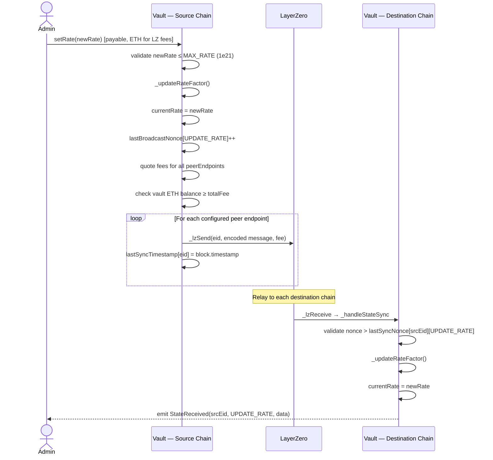

> For the complete documentation index, see [llms.txt](https://docs.tropicalwater.xyz/llms.txt). Markdown versions of documentation pages are available by appending `.md` to page URLs; this page is available as [Markdown](https://docs.tropicalwater.xyz/architecture/admin-operations.md).

# Admin Operations

### Updating Yield Rate

`setRate` on the source chain automatically broadcasts the new rate to every configured destination chain in the same transaction.



The same broadcast pattern applies to `setLockupPeriod`, `setEarlyRedemptionFee`, and `setCap`.

### Admin Parameter Reference

| Function                                                         | Default       | Hard Limits                        | Auto-Broadcasts                      |
| ---------------------------------------------------------------- | ------------- | ---------------------------------- | ------------------------------------ |
| `setRate(uint256 newRate)`                                       | 0             | ≤ `MAX_RATE` (1×10²¹, \~3150% APY) | ✅ if source chain + peers configured |
| `setLockupPeriod(uint256 newPeriod)`                             | 5 minutes     | ≤ 365 days                         | ✅                                    |
| `setEarlyRedemptionFee(uint256 newFeeBps)`                       | 500 (5%)      | ≤ 10000 (100%)                     | ✅                                    |
| `setCap(uint256 newCap)`                                         | 0 (unlimited) | None                               | ✅                                    |
| `adminWithdraw(address token, uint256 amount, address receiver)` | —             | **None** — full drain allowed      | ❌                                    |


**No timelock.** `setRate`, `setLockupPeriod`, `setEarlyRedemptionFee`, and `setCap` are all instant. Changes take effect in the same block and are immediately broadcast to all destination chains.


### Configuring a New Destination Chain

Adding a destination chain requires two steps — one for OFT message authentication (OApp layer) and one for state sync acceptance:

```solidity
// Step 1: OApp peer — authenticates incoming LZ messages
vault.setPeer(destinationEid, bytes32(uint256(uint160(destinationVaultAddress))));

// Step 2: State sync peer — allows _handleStateSync to accept messages from this EID
vault.addPeerEndpoint(destinationEid);
```

Removing a peer:

```solidity
vault.removePeerEndpoint(destinationEid);
```


Both `setPeer` and `addPeerEndpoint` must be called on the **destination vault** for it to accept incoming state syncs.

