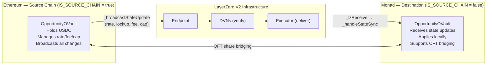
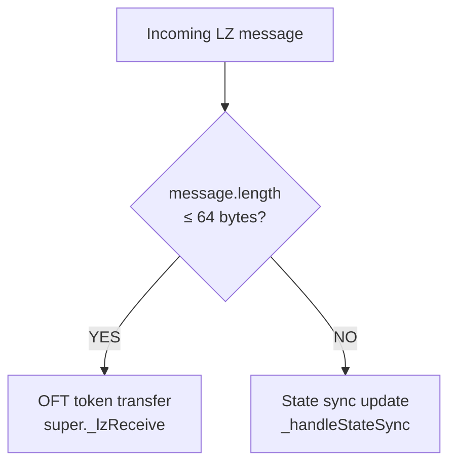

> For the complete documentation index, see [llms.txt](https://docs.tropicalwater.xyz/llms.txt). Markdown versions of documentation pages are available by appending `.md` to page URLs; this page is available as [Markdown](https://docs.tropicalwater.xyz/architecture/cross-chain-state-synchronization.md).

# Cross Chain State Synchronization

### Architecture



### What Gets Synchronized

| Parameter              | StateUpdateType        | Sync direction                                                                                             |
| ---------------------- | ---------------------- | ---------------------------------------------------------------------------------------------------------- |
| `currentRate`          | `UPDATE_RATE`          | Source → all destinations                                                                                  |
| `lockupPeriod`         | `UPDATE_LOCKUP_PERIOD` | Source → all destinations                                                                                  |
| `earlyRedemptionFee`   | `UPDATE_EARLY_FEE`     | Source → all destinations                                                                                  |
| `cap`                  | `UPDATE_CAP`           | Source → all destinations                                                                                  |
| `cumulativeRateFactor` | —                      | **Not synced** — each chain compounds independently from its local `currentRate` and `lastUpdateTimestamp` |

### Message Format

State sync messages are ABI-encoded with a minimum of 192 bytes:

```solidity
bytes memory message = abi.encode(
    uint16(2),           // MSG_TYPE_STATE_SYNC — distinguishes from OFT (40 bytes)
    nonce,               // uint256 — strictly increasing per parameter type
    updateType,          // StateUpdateType enum
    data                 // bytes — abi.encoded new parameter value
);
```

### Message Routing in `_lzReceive`



```
OFT transfer format:  bytes32(receiver) + uint64(amountSD) = 40 bytes
State sync minimum:   4 × 32 bytes header + 32 bytes data = 192 bytes
```

### Replay Protection & Nonce Ordering

Each parameter type has an independent, strictly-increasing nonce sequence:

```
Source chain:      lastBroadcastNonce[StateUpdateType]
Destination chain: lastSyncNonce[srcEid][StateUpdateType]

Rule: only accept nonce > lastSyncNonce[srcEid][type]
```


**Known limitation.** If LayerZero delivers message N+1 before message N (possible during network congestion or DVN delays), message N is permanently rejected — its nonce is already below the accepted N+1. There is no gap-fill or re-send mechanism. The destination silently diverges until the next intentional admin broadcast.

