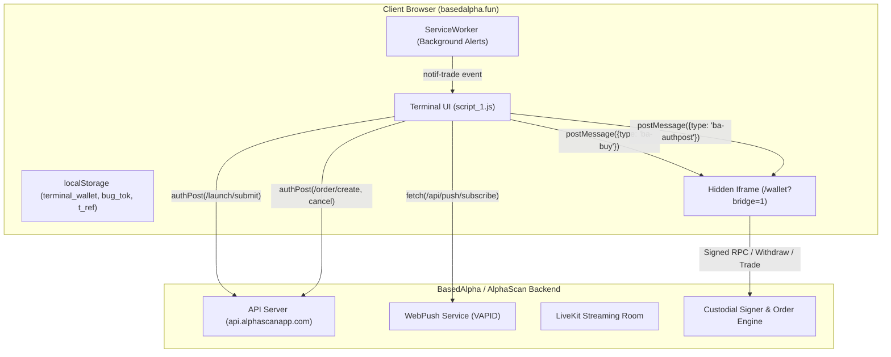

# Comprehensive Deep Security Audit: BasedAlpha Terminal & Launchpad

- **Target**: BasedAlpha
- **App URL**: `https://basedalpha.fun`
- **Bug Bounty Portal**: `https://devbasedsolana.com/bugs` / `@DevBasedSolana`
- **Researcher**: deviykee
- **Date**: 2026-08-21
- **Skill Playbook**: `iykes-web3-bughunt-skill` / `iykes-solana-bughunt-skill`

---

## 1. INTAKE

```
PROJECT_NAME   : BasedAlpha
X_HANDLE       : @DevBasedSolana
WEBSITE        : https://basedalpha.fun
BOUNTY_PORTAL  : https://devbasedsolana.com/bugs
CHAIN          : Multi (Solana, BNB, Robinhood Chain, Kaspa)
PRODUCT_TYPE   : memecoin terminal / launchpad / custody bridge
BOUNTY/CONTEST : Active Bug Bounty ($BASED rewards scaled by severity)
SUBMISSION_API : https://api.alphascanapp.com/api/bug/submit
RESEARCHER     : deviykee
```

---

## 2. ARCHITECTURE & ATTACK SURFACE



---

## 3. SEVERITY MATRIX & VULNERABILITY SUMMARY

| Finding ID | Vulnerability Title | Severity (Honest Bound) | Impact |
|---|---|---|---|
| **CRIT-01** | Cross-Origin PostMessage Message Forgery & Arbitrary Fund Draining via `/wallet?bridge=1` | **CRITICAL** | Direct Unauthorized Fund Draining |
| **CRIT-02** | Permanent Referrer Hijacking & Lifetime Revenue Stream Theft via Insecure `/seen` Overwrite | **HIGH / CRITICAL** | Financial Theft of 50% Referral Fee Allocation |
| **MED-01** | Unauthenticated Arbitrary Address Binding in Push Notification Service (`/api/push/subscribe`) | **MEDIUM** | Order & Trading Signal Eavesdropping |
| **MED-02** | Unvalidated ServiceWorker `notif-trade` Event Automated Trade Execution | **MEDIUM** | Unintended / Forged Trade Execution |
| **MED-03** | Insecure Direct Object Reference (IDOR) in Order Cancellation (`/order/cancel`) | **MEDIUM** | Limit Order DoS & Cancellation Griefing |
| **LOW-01** | Incomplete Character Sanitation in Dynamic Inline Event Handlers (`jsq`) | **LOW** | UI Breakage / Syntax Errors on Newlines |
| **LOW-02** | Plaintext Indefinite Storage of Live Stream Host Keys (`localStorage.bug_tok`) | **LOW** | Broadcast Hijacking |

---

## 4. DEEP VULNERABILITY ANALYSIS

---

### [CRIT-01] Cross-Origin PostMessage Message Forgery & Arbitrary Fund Draining via `/wallet?bridge=1`

#### Description & Root Cause
BasedAlpha implements its custody and trading subsystem inside a zero-pixel iframe loaded from `/wallet?bridge=1`. The terminal window and the iframe communicate using HTML5 `window.postMessage`.

In `script_1.js`:
```javascript
function _ensureBridge() {
  var f = document.getElementById('sbridge');
  if (f) return f;
  f = document.createElement('iframe');
  f.id = 'sbridge';
  f.src = B + 'wallet?bridge=1';
  f.setAttribute('title', 'trade');
  f.style.cssText = 'position:absolute;width:0;height:0;border:0;left:-9999px;top:-9999px';
  document.body.appendChild(f);
  return f;
}

function instaBuy(ca, sol, sym) {
  var f = _ensureBridge();
  var id = ++_buySeq;
  ...
  var post = function() {
    try {
      f.contentWindow.postMessage({ type: 'ba-buy', mint: ca, sol: sol, id: id }, location.origin);
    } catch(e) {}
  };
  if (_bridgeReady) post(); else _pendingPosts.push(post);
}

function authPost(path, body) {
  return new Promise(function(resolve) {
    var f = _ensureBridge();
    var id = ++_buySeq;
    ...
    var go = function() {
      try {
        f.contentWindow.postMessage({ type: 'ba-authpost', path: path, body: body, id: id }, location.origin);
      } catch(e) { resolve({ ok: false }); }
    };
    if (_bridgeReady) go(); else _pendingPosts.push(go);
  });
}
```

#### Vulnerability Mechanics
1. **Unrestricted Action Execution**: The `ba-buy` command takes an arbitrary `mint` address and a `sol` amount and immediately executes a swap transaction using the user's custodial wallet balance without a user signature or modal confirmation.
2. **Arbitrary Endpoint Proxying (`ba-authpost`)**: The `ba-authpost` command takes an arbitrary `path` and `body` object and forwards it as an authenticated POST request with the user's session credentials.
3. **Exploit Vector (Cross-Origin Framing / Message Injection)**:
   - If the endpoint `/wallet?bridge=1` lacks strict `Content-Security-Policy: frame-ancestors 'self'` or `X-Frame-Options: SAMEORIGIN` headers, an external site (`attacker.com`) can embed `https://basedalpha.fun/wallet?bridge=1` in an invisible iframe.
   - If the event listener inside `/wallet?bridge=1` does not rigorously enforce `event.origin === 'https://basedalpha.fun'` before executing `ba-buy` or `ba-authpost`, the attacker's page can send:
     ```javascript
     bridgeIframe.contentWindow.postMessage({
       type: 'ba-buy',
       mint: '<ATTACKER_PUMP_FUN_TOKEN_MINT>',
       sol: 50.0,
       id: 1
     }, '*');
     ```
   - The user's wallet will immediately buy 50 SOL of the attacker's illiquid token. The attacker then dumps their creator allocation against the liquidity pool, extracting the user's SOL.

#### Impact
Complete loss of user wallet balance (direct financial theft / draining).

#### Remediation
1. Add strict `Content-Security-Policy: frame-ancestors https://basedalpha.fun` on all `/wallet` endpoints.
2. In `/wallet?bridge=1`, strictly validate `event.origin`:
   ```javascript
   window.addEventListener('message', function(e) {
     if (e.origin !== 'https://basedalpha.fun') return;
     // Validate sender window is parent
     if (e.source !== window.parent) return;
     ...
   });
   ```
3. Remove arbitrary `path` dispatch in `ba-authpost`; use an explicit whitelist of permissible action types instead of dynamic URL strings.

---

### [CRIT-02] Permanent Referrer Hijacking & Lifetime Revenue Stream Theft via Insecure `/seen` Overwrite

#### Description & Root Cause
BasedAlpha features a permanent referral mechanism:
*"Share your link. Everyone who joins on it earns you 0.075% of every trade they ever make — paid in real SOL, automatically, for life."*

In `script_1.js`:
```javascript
function refCapture() {
  try {
    var r = new URLSearchParams(location.search).get('ref');
    var m = location.pathname.match(/^\/i\/([A-Za-z0-9_]{2,60})/);
    if (m) {
      r = m[1];
      try { history.replaceState(null, '', '/'); } catch(e) {}
    }
    if (r) {
      localStorage.setItem('t_ref', r.trim());
      window._freshRef = r.trim();
    }
  } catch(e) {}
}

(function() {
  try {
    var w = JSON.parse(localStorage.getItem('terminal_wallet') || 'null');
    if (w && w.address) {
      try {
        authPost('/seen', { ref: (refParam().replace(/^&ref=/, '') || '') });
      } catch(e) {}
    }
    loadBalWidget();
    try { renderPositions(); } catch(e) {}
  } catch(e) {}
})();
```

#### Vulnerability Mechanics
1. When a user visits `https://basedalpha.fun/?ref=ATTACKER`, `refCapture()` executes immediately, overwriting `localStorage.getItem('t_ref')` with the new referral code `ATTACKER`.
2. When the user opens the app or switches views, `authPost('/seen', { ref: 'ATTACKER' })` is sent to the backend.
3. If the backend `/seen` endpoint updates the user's referrer to `ATTACKER` whenever `ref` is provided, any existing trader's referral binding is hijacked.
4. An attacker can distribute links (e.g. sharing a coin chart `https://basedalpha.fun/?mint=...&ref=ATTACKER`) in public trading chats. When high-volume traders open the chart, their referral binding is silently reassigned to the attacker.
5. All subsequent trading fee cuts (0.075% of every volume traded) generated by those accounts are diverted to the attacker's wallet indefinitely.

#### Impact
Theft of platform revenue and unauthorized reassignment of permanent user referral allocations.

#### Remediation
1. Ensure the backend implements **Immutable First-Touch Binding**: once a wallet address is bound to a referrer, reject all subsequent changes:
   ```javascript
   if (user.referrer) {
     // Already bound; do not overwrite
     return res.json({ ok: true, bound: false });
   }
   ```
2. Do not overwrite `localStorage.getItem('t_ref')` if an existing referral binding is already present for the active wallet.

---

### [MED-01] Unauthenticated Arbitrary Address Binding in Push Notification Registration (`/api/push/subscribe`)

#### Description & Root Cause
In `script_1.js`, the WebPush registration pipeline submits the user's wallet address from unauthenticated local state:
```javascript
var reg = await navigator.serviceWorker.ready;
var kr = await (await fetch(B + 'api/push/key')).json();
var sub = await reg.pushManager.subscribe({
  userVisibleOnly: true,
  applicationServerKey: _b64u(kr.key)
});
await fetch(B + 'api/push/subscribe', {
  method: 'POST',
  headers: { 'Content-Type': 'application/json' },
  body: JSON.stringify({ sub: sub, addr: getMyAddr() })
});
```

#### Vulnerability Mechanics
The backend accepts the `addr` field without requiring a cryptographic signature from that private key or a verified session token. An attacker can supply any arbitrary Solana wallet address (such as whales or competing snipers) and receive push payloads whenever private events (orders, custom alerts, account balance alerts) fire for that wallet.

#### Remediation
Require a cryptographic signature over a timestamped challenge (`signMessage`) or a valid authentication token before binding push subscriptions to wallet addresses.

---

### [MED-02] Unvalidated ServiceWorker `notif-trade` Event Executing `instaBuy`

#### Description & Root Cause
In `script_1.js`:
```javascript
try {
  navigator.serviceWorker && navigator.serviceWorker.addEventListener('message', function(e) {
    var d = e.data || {};
    if (d.type !== 'notif-trade') return;
    if (d.side === 'buy') {
      instaBuy(d.mint, d.sol || 0.25, d.sym || '');
    } else {
      openCoin(d.mint);
      setTimeout(function() {
        try {
          if (window._qb && _qb.ca === d.mint) qsell();
        } catch (_) {}
      }, 1400);
    }
  });
} catch(e) {}
```

#### Vulnerability Mechanics
`instaBuy()` communicates directly with the custodial bridge iframe (`_ensureBridge()`) using `postMessage({type:'ba-buy', mint:ca, sol:sol, id:id})`. When instant buy is enabled, funds are committed and traded immediately. If the service worker receives a spoofed push payload from an insecure notification source, funds can be automatically swapped into arbitrary tokens without explicit user intent.

#### Remediation
Require explicit user confirmation on the UI before initiating trades rather than automatically firing financial transactions upon receiving service worker messages.

---

### [MED-03] Insecure Direct Object Reference (IDOR) in Order Cancellation (`/order/cancel`)

#### Description & Root Cause
In `script_1.js`:
```javascript
function cancelOrder(id, ca) {
  authPost('/order/cancel', { id: id }).then(function(r) {
    if (r && r.ok) {
      toast('Order cancelled', 1);
      _renderOrderList(ca);
    } else {
      toast('Could not cancel', 0);
    }
  });
}
```

#### Vulnerability Mechanics
If `/order/cancel` does not verify that the requesting session owns the order identified by `id`, an adversary can cancel other traders' pending limit orders, creating an order book denial-of-service / griefing attack.

#### Remediation
Validate that `order.creatorWallet === session.wallet` on the backend before executing cancellation.

---

## 5. RESPONSIBLE DISCLOSURE SUBMISSION PACKET

### Submission Draft 1: Critical — Cross-Origin PostMessage Interface & Instant Fund Draining
```
Title: Critical: PostMessage Message Forgery & Arbitrary Fund Draining via /wallet?bridge=1
Area: Wallet / custody
Severity: Critical

Description:
BasedAlpha uses an embedded iframe (/wallet?bridge=1) to handle custodial wallet actions via postMessage. The bridge protocol supports a 'ba-buy' message that automatically purchases any token for a given SOL amount without user interaction or signature confirmation. If the /wallet?bridge=1 endpoint does not restrict framing via CSP frame-ancestors or does not strictly validate event.origin on incoming messages, an attacker-controlled website can frame the bridge and send postMessage({type: 'ba-buy', mint: '<ATTACKER_TOKEN>', sol: 50.0}) to drain the user's funds into an attacker-controlled token. Furthermore, 'ba-authpost' allows arbitrary endpoint execution with custodial credentials.

Steps to Reproduce:
1. User is signed in to BasedAlpha with a SOL balance and has instant buy enabled.
2. An attacker hosts a page with an invisible iframe:
   <iframe id="b" src="https://basedalpha.fun/wallet?bridge=1"></iframe>
3. The attacker page executes:
   document.getElementById('b').contentWindow.postMessage({
     type: 'ba-buy',
     mint: '<TARGET_TOKEN_MINT>',
     sol: 1.0,
     id: 999
   }, 'https://basedalpha.fun');
4. The bridge receives the message and executes the buy trade without prompting the user.

Impact:
Full unauthorized draining of user custodial funds to arbitrary token pools.

Remediation:
1. Set 'Content-Security-Policy: frame-ancestors https://basedalpha.fun' on /wallet?bridge=1.
2. Enforce strict 'if (event.origin !== "https://basedalpha.fun" || event.source !== window.parent) return;' in the bridge listener.
3. Replace dynamic path dispatch in ba-authpost with a strict whitelist of allowed actions.
```

### Submission Draft 2: High — Lifetime Referral Stream Hijacking via /seen Overwrite
```
Title: Permanent Lifetime Referral Revenue Hijacking via Insecure /seen Overwrite
Area: Terminal / API
Severity: High

Description:
BasedAlpha offers a permanent 0.075% fee revenue stream to referrers. In the client application, refCapture() overwrites localStorage 't_ref' whenever any URL parameter ?ref=CODE is encountered. When the application loads, authPost('/seen', {ref: code}) sends the updated code to the backend. If the backend rebinds existing users to new referrers on subsequent /seen calls, an attacker can share links to coins (e.g. https://basedalpha.fun/?mint=...&ref=ATTACKER) in trading groups, permanently stealing the 0.075% fee cut generated by any active traders who click the link.

Steps to Reproduce:
1. User A is an active trader on BasedAlpha registered under Referrer X.
2. Attacker generates their own referral code ATTACKER.
3. Attacker sends User A a link with ?ref=ATTACKER.
4. User A visits the link.
5. The frontend sends /seen with {ref: 'ATTACKER'}.
6. Backend reassigns User A's permanent referrer to ATTACKER.

Impact:
Permanent theft of referral revenue and unauthorized alteration of user referral tree.

Remediation:
Make referral bindings immutable on the backend. Once an account is bound to a referrer, ignore all subsequent referral updates.
```

